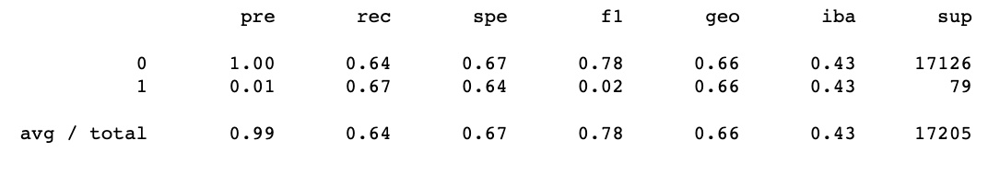
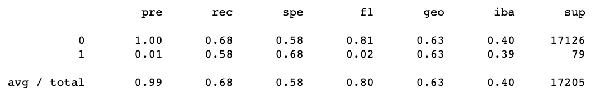
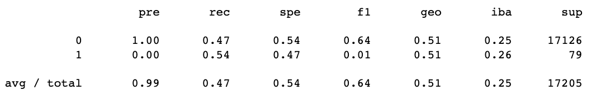
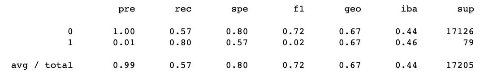
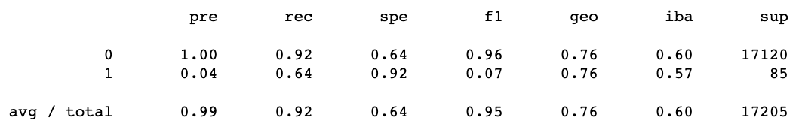
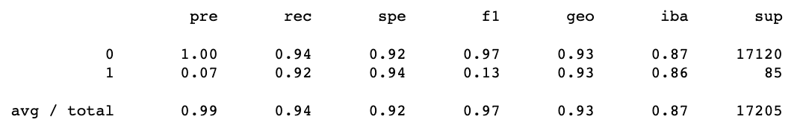

# supervised_ML

## Overview

Explain the purpose of the analysis

## Results

Bulleted lists, describe the balanced accuracy scores and precision and recall scores of all 6 ML models
Include screenshots

Naive Random Oversampling had a balanced accuracy score of 0.66. See imbalanced classification report below: 

SMOTE oversampling had a balanced accuracy score of 0.63. See imbalanced classification report below: 

Undersampling with ClusterCentroids had a balanced accuracy score of 0.51. See imbalanced classification report below: 

SMOTEENN combination over/undersampling had a balanced accuracy score of 0.68. See imbalanced classification report below: 

The ensemble learner BalancedRandomForestClassifier had a balanced accuracy score of 0.78. See imbalanced classification report below: 

The Easy Ensemble AdaBoost Classifier had a balanced accuracy score of 0.93. See imbalanced classification report below: 

## Summary 
Summarize results, include recommendation if any, if not recommending any, justify why not 